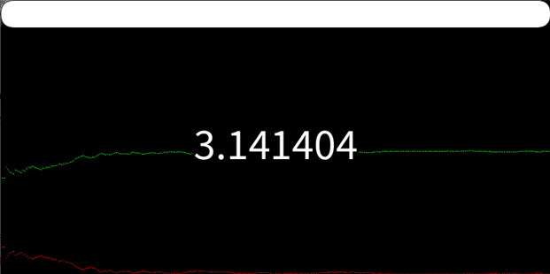

# Estimating Pi with Euclid's Algorithm and Random Numbers

## Table of Contents

- [Estimating Pi with Euclid's Algorithm and Random Numbers](#estimating-pi-with-euclids-algorithm-and-random-numbers)
  - [Table of Contents](#table-of-contents)
  - [Description](#description)
    - [Display](#display)
      - [Examples](#examples)
    - [Folder structure](#folder-structure)
    - [Programming language(s)](#programming-languages)
  - [Installation](#installation)
  - [Usage](#usage)
    - [Invokation](#invokation)
    - [Operation](#operation)
  - [Contributions](#contributions)

## Description

Animates approximating pi given a series of random numbers.  
Start date: March 16, 2021  
Current version: 0.1.0  

### Display

#### Examples

### Folder structure

| Tree with Root Having Local Path | Generation Method | Description |
| -------------------------------- | ----------------- | ----------- |
| <https://github.com/anderjef/Estimating_Pi_With_Euclid_s_Algorithm_and_Random_Numbers> | auto-generated by Processing | <!-- --> |
| [.github/](.github/) | <!-- --> | holds GitHub-specific documents |

### Programming language(s)

- Processing (Java)
  - [Estimating_Pi_With_Euclid_s_Algorithm_and_Random_Numbers.pde](Estimating_Pi_With_Euclid_s_Algorithm_and_Random_Numbers.pde)&mdash;main program entrance sets up canvas and executes animation steps

## Installation

- Download [ZIP](https://github.com/anderjef/Estimating_Pi_With_Euclid_s_Algorithm_and_Random_Numbers/archive/main.zip). Extract to a folder named Estimating_Pi_With_Euclid_s_Algorithm_and_Random_Numbers.
- Download and install [Processing 4.0 beta 1 or compatible](https://processing.org/download). Please understand that Processing may have bugs of its own.
- Open any of the Processing Source Code files with the Processing IDE (PDE).

## Usage

### Invokation

- See [Installation](#installation).
- Run the code from within the Processing IDE or export the application first (exporting requires adding [digits.txt](digits.txt) into the executable's folder).

### Operation

Fill [digits.txt](digits.txt) with a sequence of random digits&mdash;the more digits, the better the approximation. Sit back, relax, and enjoy!

## Contributions

- Jeffrey Andersen&mdash;developer
- [YouTube The Coding Train Video](https://www.youtube.com/watch?v=EvS_a921dBo)&mdash;inspiration

For copyright, license, and warranty, see [LICENSE.md](LICENSE.md).
